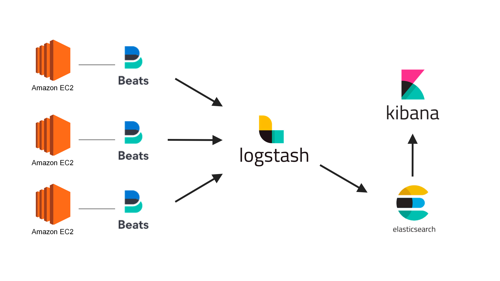
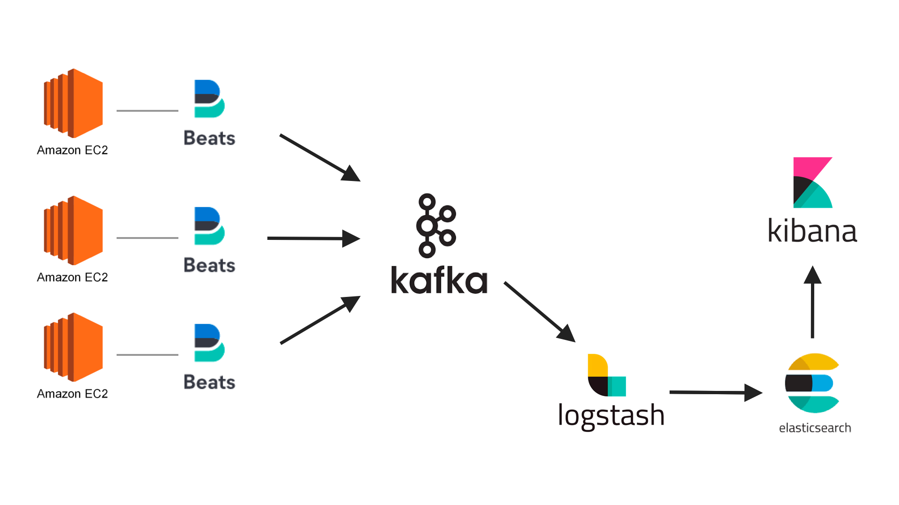

# Elastic stack (ELK) + Kafka + FileBeat on Docker

Based on [docker-elk](https://github.com/deviantony/docker-elk)

environment - macOS

## 🚀 Stack

- Filebeat
- Kafka
- Logstash
- Elasticsearch
- Kibana


### Bringing up the stack

Clone this repository onto the Docker host that will run the stack, then start services locally using Docker Compose:

```console
$ docker-compose up
```

You can also run all services in the background (detached mode) by adding the `-d` flag to the above command.

**:warning: You must rebuild the stack images with `docker-compose build` whenever you switch branch or update the
version of an already existing stack.**

If you are starting the stack for the very first time, please read the section below attentively.

### Cleanup

Elasticsearch data is persisted inside a volume by default.

In order to entirely shutdown the stack and remove all persisted data, use the following Docker Compose command:

```console
$ docker-compose down -v
```

## ⭐️ Tip

### Docker Command

#### List containers(running) 
```shell script
$ docker ps
```

#### Run a command in a running container
```shell script
$ docker exec -it {CONTAINER} /bin/bash
```

#### Fetch the logs of a container
```shell script
$ docker logs -f {CONTAINER}
```

### Kafka Command

#### kafka sh path
```shell script
$ cd opt/kafka/bin/
```

#### List the topics available on the cluster
```shell script
$ kafka-topics.sh --zookeeper zookeeper:2181 --list
```
 
#### Consumer
```shell script
$ kafka-console-consumer.sh --topic {TOPIC} --bootstrap-server kafka:9092 --from-beginning
```

#### Producer
```shell script
$ kafka-console-producer.sh --topic {TOPIC} --broker-list kafka:9092
```

### 🔥 History

1. ELK + Filebeat
    
   you can checkout "filebeat" tag.
   
   

1. ELK + Filebeat + Kafka
    
   
